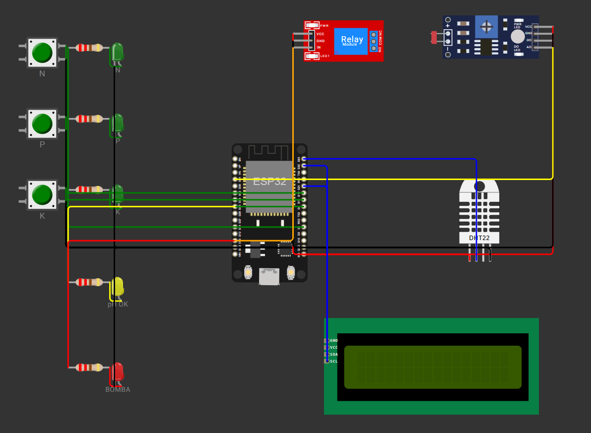

# FIAP - Faculdade de Informática e Administração Paulista

## FarmTech Solutions - Sistema de Irrigação Inteligente para Soja

### Grupo 106

### Integrantes

- Ronaldo Nishime (RM571759) - github.com/ronishime

### Professores

Coordenador(a): Andre Godoi

---

## Descrição

Projeto desenvolvido na Fase 2, Capítulo 1, da disciplina de IoT e Agricultura Digital da FIAP, no curso de Tecnologia em Inteligência Artificial. Consiste na simulação de um dispositivo eletrônico baseado em ESP32 capaz de monitorar sensores de uma fazenda e decidir automaticamente a irrigação de uma cultura de soja.

O sistema simula um dispositivo de agricultura de precisão instalado em uma lavoura de soja. Ele lê sensores de nutrientes (Nitrogênio, Fósforo, Potássio), pH do solo, umidade do solo, e decide ligar ou desligar uma bomba de irrigação conforme regras baseadas nas faixas ideais da cultura da soja, definidas pela EMBRAPA.

A decisão da irrigação considera também uma consulta climatológica obtida de uma API pública (Open-Meteo), que verifica a previsão de chuva nas próximas 6 horas e pode suspender a irrigação para economizar água.

O circuito foi montado no simulador Wokwi, utilizando um ESP32 DevKit v1, três botões verdes representando os sensores NPK, um sensor LDR como proxy de pH, um sensor DHT22 para umidade do solo, um módulo relé representando a bomba d'água, um LCD 16x2 I2C para exibição de informações, além de cinco LEDs de status (três verdes para NPK, um amarelo para pH ideal, um vermelho para a bomba).

A lógica de decisão da bomba segue uma hierarquia de quatro regras avaliadas em ordem de prioridade. A primeira regra aplicável define o estado final da bomba. Se houver previsão de chuva vinda do script Python, a irrigação é bloqueada. Se a umidade do solo estiver abaixo de 40%, a bomba liga. Se a umidade estiver acima de 70%, a bomba desliga. Na zona intermediária entre 40% e 70%, a bomba liga apenas se o pH estiver na faixa ideal da soja (5,5 a 6,3) e pelo menos um dos nutrientes críticos (P ou K) estiver presente.

O Nitrogênio não influencia a decisão de irrigação, pois a soja realiza Fixação Biológica de Nitrogênio através de bactérias simbióticas nas raízes, normalmente dispensando adubação nitrogenada (Embrapa Soja, 2009). O N é mantido apenas como indicador de monitoramento.

A integração com a API Open-Meteo é feita manualmente, por escolha consciente, pois o Wokwi gratuito não permite comunicação bidirecional nativa entre Python e a simulação ESP32. O enunciado da atividade autoriza essa abordagem. O script Python consulta a API, analisa as próximas 6 horas e retorna uma linha formatada pronta para ser copiada ao sketch.ino como constante CHUVA_PREVISTA.



**Link do vídeo de demonstração:** https://youtu.be/Nb3GyiMSb8Q

---

## Estrutura de pastas

Dentre os arquivos e pastas presentes na raiz do projeto, definem-se:

- **.github**: pasta para arquivos de configuração específicos do GitHub, gerenciando e automatizando processos no repositório.
- **assets**: imagens do projeto, incluindo a visão geral do circuito e a captura da simulação em execução.
- **config**: pasta reservada para arquivos de configuração e parâmetros do projeto.
- **document**: pasta reservada para documentos do projeto.
- **scripts**: pasta reservada para scripts auxiliares (deploy, migrações, backups).
- **src**: código-fonte principal do projeto, dividido em duas subpastas:
  - **src/wokwi**: arquivos da simulação eletrônica, incluindo diagram.json (definição do circuito), sketch.ino (código C/C++ do ESP32), libraries.txt e wokwi-project.txt.
  - **src/python**: script consulta_clima.py que consulta a API Open-Meteo.
- **README.md**: arquivo que serve como guia e explicação geral sobre o projeto.

---

## Como executar o código

### Pré-requisitos

- Navegador com acesso a https://wokwi.com
- Python 3.10 ou superior
- Biblioteca Python: requests
- Git (para clonar o repositório)

### Passos

**1. Clonar o repositório**

```
git clone https://github.com/ronishime/fiap-fase2-cap1-farmtech.git
cd fiap-fase2-cap1-farmtech
```

**2. Executar a consulta climática (Opcional 1)**

```
pip install requests
python src/python/consulta_clima.py
```

O script consulta a API Open-Meteo e imprime uma linha formatada como `#define CHUVA_PREVISTA false` (ou `true`), a ser copiada manualmente ao sketch.ino.

**3. Simular o circuito no Wokwi**

- Acessar https://wokwi.com/projects/461667134987342849 (projeto online).
- Alternativamente, criar um novo projeto ESP32 no Wokwi e colar o conteúdo de src/wokwi/diagram.json e src/wokwi/sketch.ino.
- Atualizar a constante CHUVA_PREVISTA no sketch.ino conforme saída do script Python.
- Clicar em play e observar a simulação.

**4. Interação na simulação**

- Botões N, P, K: clicar e segurar para simular a presença do nutriente.
- LDR: ajustar o slider de luminosidade para alterar o pH simulado (menos lux = pH mais alto; 145 lux corresponde a pH aproximado de 6,1).
- DHT22: ajustar o slider de umidade para testar as diferentes regras.
- LCD: alterna a cada 3 segundos entre tela de sensores (umidade e pH) e tela de status (bomba e NPK).
- LEDs: fornecem feedback visual imediato de cada condição.

### Pinagem do ESP32

| Componente | Pino GPIO | Função |
|---|---|---|
| Botão N | 18 | Entrada digital (INPUT_PULLUP) |
| Botão P | 19 | Entrada digital (INPUT_PULLUP) |
| Botão K | 5 | Entrada digital (INPUT_PULLUP) |
| LDR (pH) | 34 (ADC1_CH6) | Entrada analógica |
| DHT22 (umidade) | 23 | Interface 1-Wire |
| Relé (bomba) | 13 | Saída digital |
| LED N | 4 | Saída digital |
| LED P | 16 | Saída digital |
| LED K | 17 | Saída digital |
| LED pH OK | 25 | Saída digital |
| LED bomba | 13 | Compartilhado com o relé |
| LCD SDA | 21 | I2C (dados) |
| LCD SCL | 22 | I2C (clock) |

O pino 34 foi escolhido no ADC1, pois o ADC2 do ESP32 fica inoperante quando o Wi-Fi está ativo. Pinos de boot/strapping (0, 2, 12, 15) foram evitados.

### Faixas ideais da soja (fonte: EMBRAPA)

| Parâmetro | Faixa ideal |
|---|---|
| pH do solo | 5,5 a 6,3 |
| Umidade do solo | 50% a 85% da água disponível |
| Fósforo (P) | Essencial, adubação de 90 a 100 kg/ha P2O5 em solos pobres |
| Potássio (K) | Essencial, valor crítico 50 mg/dm³ no solo |
| Nitrogênio (N) | Suprido pela FBN, adubação nitrogenada normalmente desnecessária |

### Demonstração da simulação


A imagem acima mostra a simulação em execução, exibindo no circuito o LED amarelo "pH OK" aceso (pH 6,10 dentro da faixa ideal) e LED vermelho da bomba apagado. No LCD, a tela de status mostra "Bomba: desligada" e ausência de nutrientes (N:0 P:0 K:0). No Monitor Serial, a saída detalhada com todos os sensores, incluindo a linha "Chuva prevista: nao" que vem do script Python. O motivo da decisão, "Umidade intermediaria, mas falta P e K", confirma que a lógica composta da zona intermediária está aplicando corretamente a regra de exigir pelo menos um nutriente crítico presente.

### Referências

- EMBRAPA Soja. *Tecnologias de Produção de Soja Região Central do Brasil*. Sistemas de Produção, 2009 e 2010.
- EMBRAPA. *Correção do Solo e Adubação da Cultura da Soja*. Circular Técnica 33, 1987.
- EMBRAPA. *Muda a tabela de adubação da soja*. Portal Embrapa.
- Faria, R. T. *Indicadores da condição hídrica do solo com soja em plantio direto e preparo convencional*. Revista Brasileira de Engenharia Agrícola e Ambiental, v. 13, n. 4, 2009.
- Open-Meteo. *Free Weather API Documentation*. Disponível em https://open-meteo.com/en/docs.
- Wokwi. *ESP32 Simulator Documentation*. Disponível em https://docs.wokwi.com.

---

## Histórico de lançamentos

- 1.0.0 - 18/04/2026: versão final entregue, com circuito Wokwi, código C/C++ do ESP32, script Python de consulta climatológica, README documentado e vídeo de demonstração.
- 0.3.0 - 18/04/2026: integração do Opcional 1 (Python e API Open-Meteo) com a constante CHUVA_PREVISTA no sketch.
- 0.2.0 - 18/04/2026: circuito expandido com LCD 16x2, cinco LEDs de status, módulo relé e adequação dos pinos do ESP32.
- 0.1.0 - 18/04/2026: estrutura inicial do repositório, circuito básico no Wokwi e código do ESP32 com lógica central de irrigação.

---

## Licença

MODELO GIT FIAP por Fiap está licenciado sobre Attribution 4.0 International.
