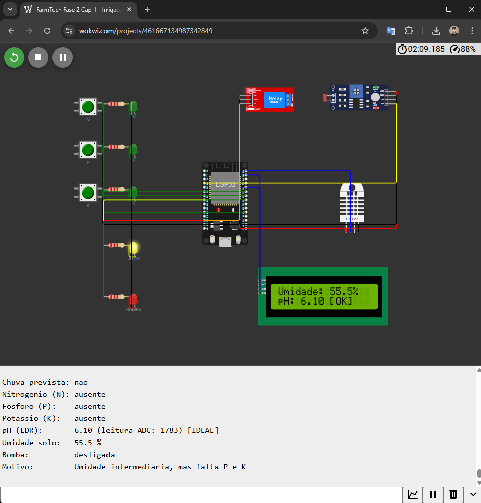

# FarmTech Solutions - Sistema de Irrigação Inteligente para Soja

Projeto desenvolvido na disciplina de **IoT e Agricultura Digital** da FIAP, Fase 2 Cap 1. Simulação de um dispositivo eletrônico baseado em ESP32 capaz de monitorar sensores de uma fazenda e decidir automaticamente a irrigação de uma cultura de soja.

## Identificação

- **Instituição:** FIAP
- **Curso:** Tecnologia em Inteligência Artificial
- **Grupo:** Grupo 106 (1 aluno)
- **Aluno:** Ronaldo Nishime (RM571759) - github.com/ronishime
- **Fase:** 2 - Capítulo 1
- **Atividade:** Projeto 2 - Iniciando a coleta de dados

## Vídeo de demonstração

O vídeo abaixo demonstra o funcionamento completo do sistema, incluindo a consulta climatológica via Python, a lógica de decisão no ESP32 e os três cenários principais de acionamento da bomba.

**Link do vídeo:** https://youtu.be/Nb3GyiMSb8Q

## Visão geral

O sistema simula um dispositivo de agricultura de precisão instalado em uma lavoura de soja. Ele lê sensores de nutrientes (N, P, K), pH do solo, umidade do solo, e decide ligar ou desligar uma bomba de irrigação conforme regras baseadas nas faixas ideais da cultura da soja, definidas pela EMBRAPA.

A decisão da irrigação considera também uma consulta climatológica obtida de uma API pública (Open-Meteo), que verifica a previsão de chuva nas próximas 6 horas e pode suspender a irrigação para economizar água.

## Tecnologias utilizadas

- **ESP32 DevKit v1** (microcontrolador, simulado no Wokwi).
- **C/C++** para o firmware do ESP32 (Arduino framework).
- **Wokwi** para simulação do circuito eletrônico.
- **Python 3.13** para consulta da API climatológica.
- **Open-Meteo Forecast API** como fonte de dados meteorológicos.
- **Git/GitHub** para versionamento.

## Estrutura do repositório

```
fiap-fase2-cap1-farmtech/
├── README.md                    Documentação principal (este arquivo)
├── .gitignore                   Arquivos ignorados pelo Git
├── imagens/
│   ├── circuito_geral.png       Visão geral do circuito
│   └── execucao_completa.png    Simulação em execução com Monitor Serial
├── wokwi/
│   ├── diagram.json             Definição do circuito (Wokwi)
│   ├── sketch.ino               Código C/C++ do ESP32
│   ├── libraries.txt            Bibliotecas utilizadas
│   └── wokwi-project.txt        Metadados do projeto Wokwi
└── python/
    └── consulta_clima.py        Script Python de consulta climatológica
```

## Circuito eletrônico


O circuito é composto por:

- 1 ESP32 DevKit v1.
- 3 botões verdes representando os sensores de Nitrogênio (N), Fósforo (P) e Potássio (K). Cada botão, quando pressionado, indica a presença do nutriente correspondente no solo.
- 1 sensor LDR (photoresistor) usado como substituto simulado de um sensor de pH. A leitura analógica é mapeada linearmente para uma escala de pH de 0 a 14.
- 1 sensor DHT22 como medidor de umidade do solo (substituto didático, visto que o DHT22 mede umidade do ar na prática).
- 1 módulo relé representando a bomba d'água (atuador liga/desliga).
- 1 LCD 16x2 com interface I2C para exibição de informações.
- 5 LEDs de status (3 verdes para NPK, 1 amarelo para pH ideal, 1 vermelho para bomba ligada), cada um protegido por resistor de 220 ohms.

### Pinagem (ESP32)

| Componente | Pino GPIO | Função |
|---|---|---|
| Botão N | 18 | Entrada digital (INPUT_PULLUP) |
| Botão P | 19 | Entrada digital (INPUT_PULLUP) |
| Botão K | 5 | Entrada digital (INPUT_PULLUP) |
| LDR (pH) | 34 (ADC1_CH6) | Entrada analógica |
| DHT22 (umidade) | 23 | Interface 1-Wire |
| Relé (bomba) | 13 | Saída digital |
| LED N | 4 | Saída digital |
| LED P | 16 | Saída digital |
| LED K | 17 | Saída digital |
| LED pH OK | 25 | Saída digital |
| LED bomba | 13 | Compartilhado com o relé |
| LCD SDA | 21 | I2C (dados) |
| LCD SCL | 22 | I2C (clock) |

O pino 34 foi escolhido propositalmente no ADC1, pois o ADC2 do ESP32 fica inoperante quando o Wi-Fi está ativo (necessário para futura integração automática com APIs). Pinos de boot/strapping (0, 2, 12, 15) foram evitados.

## Lógica de decisão da bomba

A decisão de ligar ou desligar a bomba segue uma hierarquia de regras, avaliadas em ordem de prioridade. A primeira regra aplicável define o estado final da bomba.

### Regras

1. **Chuva prevista (vinda do Python/Open-Meteo):** se a previsão das próximas 6 horas indicar chuva acumulada superior a 2 mm ou probabilidade máxima acima de 60%, a irrigação é bloqueada independentemente dos demais sensores.

2. **Umidade do solo abaixo de 40%:** a bomba é ligada, pois a planta necessita de água urgentemente.

3. **Umidade do solo acima de 70%:** a bomba é desligada, pois o solo está saturado.

4. **Umidade entre 40% e 70% (zona intermediária):** a bomba liga apenas se o pH estiver na faixa ideal da soja (5,5 a 6,3) E pelo menos um dos nutrientes críticos (P ou K) estiver presente. Caso contrário, fica desligada.

O Nitrogênio (N) não influencia a decisão de irrigação, pois a soja realiza Fixação Biológica de Nitrogênio através de bactérias simbióticas nas raízes, normalmente dispensando adubação nitrogenada (Embrapa Soja, 2009). O N é mantido apenas como indicador de monitoramento.

### Faixas ideais da soja (fonte: EMBRAPA)

| Parâmetro | Faixa ideal |
|---|---|
| pH do solo | 5,5 a 6,3 |
| Umidade do solo | 50% a 85% da água disponível |
| Fósforo (P) | Essencial, adubação de 90 a 100 kg/ha P2O5 em solos pobres |
| Potássio (K) | Essencial, valor crítico 50 mg/dm³ no solo |
| Nitrogênio (N) | Suprido pela FBN, adubação nitrogenada normalmente desnecessária |

## Opcional 1: integração Python com API Open-Meteo

O script `python/consulta_clima.py` consulta a API pública Open-Meteo (sem necessidade de cadastro ou API key) para obter a previsão climática para Mogi das Cruzes, SP (coordenadas -23.52, -46.19).

### Fluxo de integração

1. Usuário executa `python python/consulta_clima.py`.
2. Script consulta a API Open-Meteo e analisa as próximas 6 horas.
3. Aplica regra de decisão: bloqueia irrigação se chuva acumulada > 2 mm ou probabilidade > 60%.
4. Exibe no terminal uma linha formatada pronta para copiar ao `sketch.ino`:

```
#define CHUVA_PREVISTA false   // Atualizado em 18/04/2026 17:46
```

5. Usuário atualiza manualmente a constante `CHUVA_PREVISTA` no `sketch.ino`.
6. Ao rodar a simulação no Wokwi, o ESP32 respeita o bloqueio quando `CHUVA_PREVISTA == true`.

A integração é manual por escolha consciente: o Wokwi gratuito não permite comunicação bidirecional nativa entre Python e a simulação ESP32. O enunciado da atividade autoriza essa abordagem.

## Como executar

### Requisitos

- Navegador com acesso a https://wokwi.com.
- Python 3.10 ou superior.
- Biblioteca Python: `requests`.

### Passos

1. **Clonar o repositório:**
   ```
   git clone https://github.com/ronishime/fiap-fase2-cap1-farmtech.git
   cd fiap-fase2-cap1-farmtech
   ```

2. **Executar a consulta climática (Opcional 1):**
   ```
   pip install requests
   python python/consulta_clima.py
   ```
   Anote o valor de `CHUVA_PREVISTA` retornado.

3. **Simular o circuito no Wokwi:**
   - Acesse https://wokwi.com/projects/461667134987342849 (projeto online).
   - Ou crie um novo projeto ESP32 e cole o conteúdo de `wokwi/diagram.json` e `wokwi/sketch.ino`.
   - Atualize a constante `CHUVA_PREVISTA` no `sketch.ino` conforme saída do script Python.
   - Clique em play e observe a simulação.

### Interação na simulação

- **Botões N, P, K:** clique e segure para simular a presença do nutriente.
- **LDR:** ajuste o slider de luminosidade para alterar o pH simulado (menos lux = pH mais alto; 145 lux ≈ pH 6,1).
- **DHT22:** ajuste o slider de umidade para testar as diferentes regras.
- **LCD:** alterna a cada 3 segundos entre tela de sensores (umidade/pH) e tela de status (bomba/NPK).
- **LEDs:** fornecem feedback visual imediato de cada condição.

## Demonstração



A imagem acima mostra a simulação em execução, exibindo:

- No circuito: LED amarelo "pH OK" aceso (pH 6,10 dentro da faixa ideal) e LED vermelho da bomba apagado.
- No LCD: tela de status mostrando "Bomba: desligada" e ausência de nutrientes (N:0 P:0 K:0).
- No Monitor Serial: saída detalhada com todos os sensores, incluindo a linha "Chuva prevista: nao" que vem do script Python.
- Motivo da decisão: "Umidade intermediaria, mas falta P e K", mostrando que a lógica composta da zona intermediária está aplicando corretamente a regra de exigir pelo menos um nutriente crítico presente.

## Referências

- EMBRAPA Soja. *Tecnologias de Produção de Soja Região Central do Brasil*. Sistemas de Produção, 2009 e 2010.
- EMBRAPA. *Correção do Solo e Adubação da Cultura da Soja*. Circular Técnica 33, 1987.
- EMBRAPA. *Muda a tabela de adubação da soja*. Portal Embrapa.
- Faria, R. T. *Indicadores da condição hídrica do solo com soja em plantio direto e preparo convencional*. Revista Brasileira de Engenharia Agrícola e Ambiental, v. 13, n. 4, 2009.
- Open-Meteo. *Free Weather API Documentation*. Disponível em https://open-meteo.com/en/docs.
- Wokwi. *ESP32 Simulator Documentation*. Disponível em https://docs.wokwi.com.

## Licença

Projeto acadêmico desenvolvido para a FIAP. Uso livre para fins educacionais.
